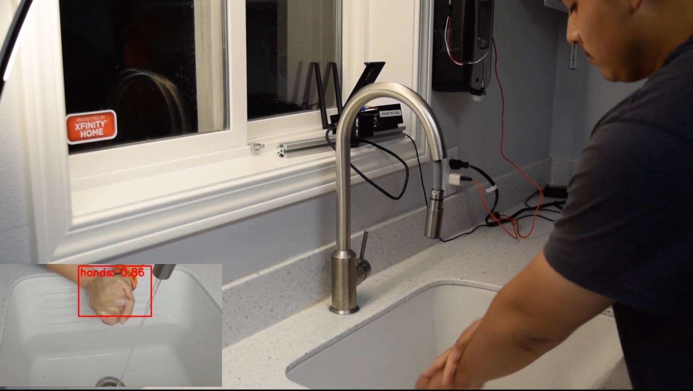
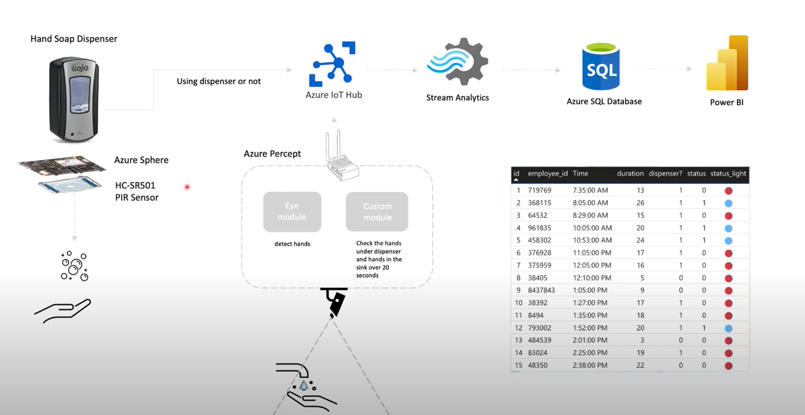

# hand-hygiene-compliance-with-azure-percept

Did you know that each year in the United States about 75,000 people will die from a hospital acquired infection? Think about it, that is more than 200 people every single day.

The goal of this project is to be able to detect if users washed their hands for over 20 seconds using Azure Percept Vision, and check whether users are using despenser or not through Azure Sphere and PIR Sensor.

## Prerequisites
- Percept DK ([Purchase](https://www.microsoft.com/en-us/store/build/azure-percept/8v2qxmzbz9vc))
- Azure Subscription : [Free trial account](https://azure.microsoft.com/en-us/free/)
- An Azure Container Registry repository or create it by following [here](https://docs.microsoft.com/en-us/azure/iot-edge/tutorial-develop-for-linux?view=iotedge-2020-11#create-a-container-registry)
- Docker for image building
- Azure Sphere ([Purchase](https://azure.microsoft.com/en-us/services/azure-sphere/get-started/))

## Solution Architecture

## Device setup
1. Follow [Quickstart: unbox and assemble your Azure Percept DK components](https://docs.microsoft.com/en-us/azure/azure-percept/quickstart-percept-dk-unboxing) and the next steps.

## Content

| File             | Description                                                   |
|-------------------------|---------------------------------------------------------------|
| `readme.md`             | This readme file                                              |
| `deployment.template.json`    | The delopyment the edge modules of this Smart Plug Solution |
| `envtemplate`    | The list of the enviroment varialbes for .env use |

## Steps
1. Create a file named `.env` in this folder based on `envtemplate`. Provide values for all variables.
2. Visit the [evaluatemodule folder](https://github.com/leannhuang/hand-hygiene-compliance-with-azure-percept/tree/main/modules/evaluatemodule) to deploy edge modules on your edge device
   

### Credits and references
- [Azure Percept documentation](https://docs.microsoft.com/en-us/azure/azure-percept/)
